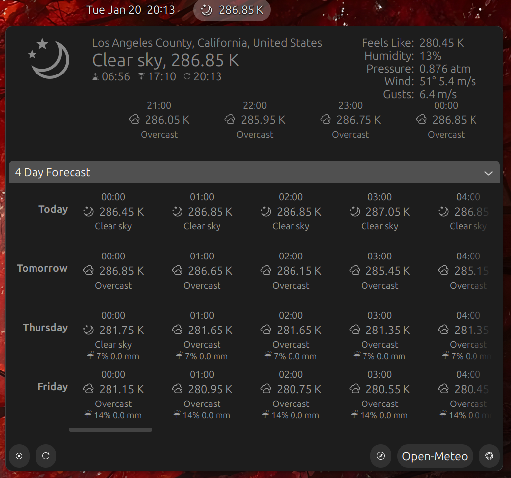

# Open-Meteo GNOME

Open-Meteo GNOME is an **unofficial, community-maintained** GNOME Shell extension for displaying current weather conditions and short-term forecasts for a user-selected location.

The extension is highly configurable and operates independently of GNOME Weather. Weather data is retrieved from the [Open-Meteo](https://open-meteo.com/) API, including multi-day forecasts with 1-hour intervals.

This project is not affiliated with or endorsed by Open-Meteo.

[](./screenshot.png)

---

## Features

- Current weather conditions
- Short-term forecasts, including today (up to 8 days, 1-hour intervals)
- Location-based configuration
- Independent of GNOME Weather
- Configurable display and behavior

---

## Project Status

This project is forked from a mature upstream project and has been significantly refactored.
The weather provider and external API dependency have been removed, and a substantial amount of code has been simplified or modified.

The project is currently in a stable state.  
Unless major issues arise, no active updates are expected.

The maintainer develops and tests the project against the GNOME version shipped with the latest Ubuntu LTS release, currently GNOME 46.
Compatibility with other GNOME versions is not guaranteed and depends on community testing and contributions.

---

## Contributing

This project is not actively maintained. Those who wish to contribute or maintain it further are welcome to do so via pull requests.

---

### Translations

Translation contributions are welcome.  
Localization files are located in `./po/*.po`.

---

### Install From Source

This method installs to your `~/.local/share/gnome-shell/extensions` directory from the latest stable source code on the default branch.

First make sure you have the following dependencies installed:

| Arch-Based     | Debian-Based                  | Fedora                 |
| ---            | ---                           | ---                    |
| `dconf`        | `dconf-gsettings-backend`     | `dconf`                |
| `gnome-shell`  | `gnome-shell-extension-prefs` | `gnome-extensions-app` |
| `git`          | `git`                         | `git`                  |
| `base-devel`   | `build-essential`             | `glib2-devel`          |
|                | `gettext`                     | `gettext-devel`        |
|                | `libsoup3`                    |                        |

Run the following commands:

```shell
git clone https://github.com/WwkChina/gnome-openmeteo.git

cd gnome-openmeteo

make && make install
```

Restart the GNOME shell:

- X11: `Alt` + `F2`, `r`, `Enter`
- Wayland: Log out/Reboot

---

### Credits

This project is a fork of [Teal Penguin](https://github.com/romanlefler/gnome-openweather)'s. See [`AUTHORS`](./AUTHORS) for previous contributor details.

---

### License

Open-Meteo is free software available under the terms of the GPLv3 license. See [`COPYING`](./COPYING) for details.
